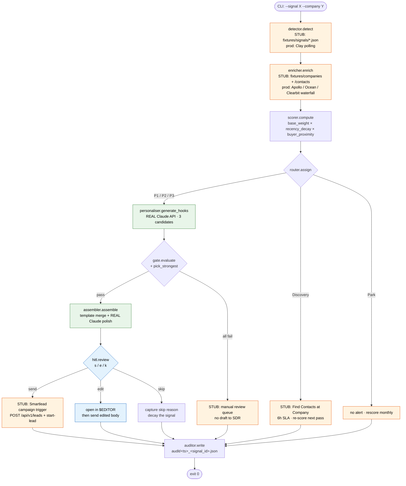

# Mento Signal Engine

Working code companion to Part 3 of the [Mento GTM Engineer case study](../../README.md). Demonstrates the buying signal workflow described in [`03_workflow_architecture_text.md`](../03_workflow_architecture_text.md) as runnable Python.

## What's Real, What's Mocked

Roughly **65% real working code, 35% mocked**. Mocking is concentrated at external API boundaries.

### Real Working Code

| Component | Why real |
|---|---|
| Scoring formula | Pure math, no dependencies |
| Routing tiers (P1/P2/P3/Discovery/Park) | Pure deterministic logic |
| Personalisation Agent | Real Claude API call (`claude-sonnet-4-6`) |
| Strong-Hook Gate | Real LLM evaluation + deterministic length / regex checks |
| Draft Assembly Agent | Real Claude API call |
| CLI HITL prompt | Real interactive `[s]end / [e]dit / [k]ip` |
| Audit logger | Writes JSON to `audit/` per signal event |
| Tests | pytest, 45 tests, 94% coverage on the deterministic core |

### Mocked (with `# STUB:` comments)

| Component | Why mocked | Production replacement |
|---|---|---|
| Signal detection | No paid API access | Crunchbase API, LinkedIn (Apify), Greenhouse + Lever (Firecrawl), Clearbit + PDL |
| Company / contact enrichment | Same | Apollo, Ocean.io, Clearbit, ZoomInfo, PDL, Crunchbase, BuiltWith |
| HubSpot lookup + write | Requires OAuth + account | HubSpot CRM API |
| Slack DM delivery | Requires workspace + bot token | Slack Web API + Block Kit |
| Smartlead trigger | Requires account | Smartlead REST API |

Every stub line carries a `# STUB:` comment with a one-line note on what would replace it.

## What The Reviewer Sees

```bash
$ uv run python -m signal_engine.run --signal funding --company linear

[1/5] Detecting signal: funding @ linear...
      sig_linear_funding_2026_05_10 (crunchbase, fired 2026-05-10)
[2/5] Enriching (mocked Clay waterfall)...
      company=Linear icp_total=18 | contact=Karri Saarinen (CEO)
[3/5] Scoring...
      base_weight       4.000  (funding signal)
      recency_decay     0.875  (4 days, half-life 30)
      buyer_proximity   1.000  (CEO, engagement=7)
      signal_score      3.501
[4/5] Routing: P1
      # STUB: SDR direct DM (would post to #sdr-priority, 60s SLA)
[5/5] Drafting via Claude API...
      Personalisation Agent: generating 3 hook candidates...
      Strong-Hook Gate: evaluating candidates...
      Selected hook: candidate 2
      Draft Assembly Agent: merging template + hook...

────────────────────────────────────────────────────────────
 DRAFT (Claude-generated)
────────────────────────────────────────────────────────────
Subject: manager bench

Hi Karri,

Saw Linear's $82M Series C from Accel close last week. With the
agent-triage rollout in parallel, your headcount math probably gets
interesting fast.

Pattern post-funding: hiring outpaces the manager bench by 90 days.
Performance dips at the team-lead layer. Brex and Vercel saw it. Their
People teams worked with our coaches in months 3-9.

Happy to share the playbook.

Worth 15 minutes?

— Alex
────────────────────────────────────────────────────────────

[s]end / [e]dit / [k]ip > _
```

The draft is a live Claude API output, not a hardcoded string.

## For the Reviewer — Six Steps to See It Work

1. **Clone the repo and move into the build directory.**

   ```bash
   git clone https://github.com/gitgitbangbang/mento-gtme-case-study.git
   cd mento-gtme-case-study/03_signal_workflow/build
   ```

2. **Set your `ANTHROPIC_API_KEY`.** The repo ships an `.env.example`. Copy it and paste your key in. `.env` is gitignored, so it stays on your machine.

   ```bash
   cp .env.example .env
   # then open .env and set:
   # ANTHROPIC_API_KEY=sk-ant-...
   ```

   If you'd rather export it inline:

   ```bash
   export ANTHROPIC_API_KEY=sk-ant-...
   ```

3. **Install and run.** [`uv`](https://docs.astral.sh/uv/) handles Python 3.12 + the lockfile.

   ```bash
   uv sync
   uv run python -m signal_engine.run --signal funding --company linear
   ```

4. **Watch a real signal flow through every stage.** The CLI prints stage-by-stage status:

   - **[1/5] Detection** loads the signal from `fixtures/signals/` (STUB for Clay polling)
   - **[2/5] Enrichment** loads the matching company + buyer contact (STUB for the Apollo / Ocean / Clearbit waterfall)
   - **[3/5] Scoring** computes `base_weight × recency_decay × buyer_proximity`
   - **[4/5] Routing** assigns P1 / P2 / P3 / Discovery / Park
   - **[5/5] Drafting** is the real agentic layer — Personalisation Agent (live Claude call) → Strong-Hook Gate (live Claude judge call + deterministic checks) → Draft Assembly Agent (live Claude polish call)

5. **Approve / edit / skip the draft at the HITL prompt.** When the draft prints, you'll see:

   ```
   [s]end / [e]dit / [k]ip > _
   ```

   - `s` simulates sending via Smartlead (prints what the production Smartlead call would do — no real send)
   - `e` opens the body in `$EDITOR` (default `vim`) so you can adjust copy before send
   - `k` skips the signal; production would decay it and capture a reason

6. **Read the audit log and the generated email.** After every run the CLI prints the audit-file path:

   ```
   [AUDIT] audit/20260514T131442Z_sig_linear_funding_2026_05_10.json
   ```

   That file captures the full trace: signal payload, enrichment data, score breakdown (every multiplier visible), tier, all hook candidates with their gate verdicts, the selected hook, the final draft body, and your Send / Edit / Skip decision. Open it to see what the engine did, in order, with full traceability.

   For terminal-readable rendering, use the audit inspector:

   ```bash
   uv run python -m signal_engine.inspect_audit --latest
   # or
   uv run python -m signal_engine.inspect_audit audit/20260514T131558Z_sig_retool_headcount_2026_04_23.json
   ```

### Try the Other Three Signals

Available signals: `funding`, `exec_hire`, `ld_posting`, `headcount_growth`.
Available companies: `linear`, `vanta`, `ramp`, `retool`.

```bash
uv run python -m signal_engine.run --signal exec_hire --company vanta
uv run python -m signal_engine.run --signal ld_posting --company ramp
uv run python -m signal_engine.run --signal headcount_growth --company retool
```

Each produces a different tier (Linear=P1, Vanta=P2, Ramp=P2, Retool=P3) so you can see routing diverge in practice. Captured example outputs from a recent live run sit in [`examples/`](./examples/).

### Run the Tests

```bash
uv run pytest
```

45 tests, 94% coverage on the deterministic core (scorer, router, gate, auditor). No API key needed — the gate tests use a stubbed Claude client.

### Useful Flags

- `--non-interactive` — skip the HITL prompt (treats every draft as Send). For CI / smoke tests.
- `--no-polish` — skip the assembler's final Claude voice pass. Saves one API call per run.
- `--sdr-signature "Your Name"` — override the signoff (default `Alex`).
- `-v` / `--verbose` — echo INFO-level pipeline logs to stderr.

## Project Structure

```
build/
├── src/signal_engine/        # Python package
│   ├── constants.py          # Tuneable thresholds (weights, decay, gate)
│   ├── models.py             # Frozen dataclasses passed between stages
│   ├── detector.py           # Stage 1: signal detection (STUB: Clay)
│   ├── enricher.py           # Stage 2: enrich Company + Contact (STUB: waterfalls)
│   ├── scorer.py             # Stage 3: signal_score formula
│   ├── router.py             # Stage 4: P1/P2/P3/Discovery/Park tier
│   ├── personaliser.py       # Personalisation Agent (real Claude API)
│   ├── gate.py               # Strong-Hook Gate (LLM + deterministic checks)
│   ├── assembler.py          # Draft Assembly Agent (real Claude API)
│   ├── hitl.py               # CLI Send/Edit/Skip prompt
│   ├── auditor.py            # JSON audit logging
│   ├── run.py                # CLI entry point
│   └── templates/            # 4 signal-specific email templates
├── fixtures/                 # Mock data for the four scenarios
│   ├── signals/
│   ├── companies/
│   └── contacts/
├── tests/                    # pytest suite (45 tests, 94% core coverage)
├── audit/                    # JSON audit logs (gitignored, created at runtime)
├── examples/                 # Captured CLI runs from `uv run ...`
├── pyproject.toml            # uv-managed
└── README.md                 # This file
```

## Architecture

See [`../03_workflow_architecture_text.md`](../03_workflow_architecture_text.md), [`../03_signal_scoring_framework.md`](../03_signal_scoring_framework.md), and [`../03_outreach_drafts.md`](../03_outreach_drafts.md). This code is a faithful implementation of those docs.



Legend: orange = STUB (mocked I/O), green = live Claude API call, blue = SDR human-in-the-loop. Everything else is pure Python with no external dependencies.

Discovery and Park exit early before the agentic layer. Manual review fires when no hook candidate clears the Strong-Hook Gate. Every exit path writes a full audit entry.

## Why This Exists

The case study includes both a no-code Clay build (for Part 2's data foundation) and this code build (for Part 3's signal engine). Each picks the right tool for its problem. Together they demonstrate full-stack GTM Engineer competence: operator no-code at the data layer, code where the agentic logic and orchestration deserve real implementation.
